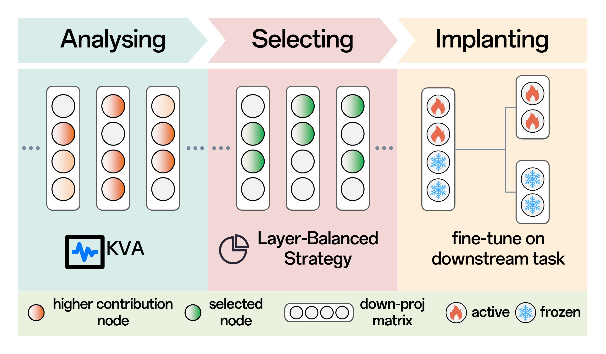
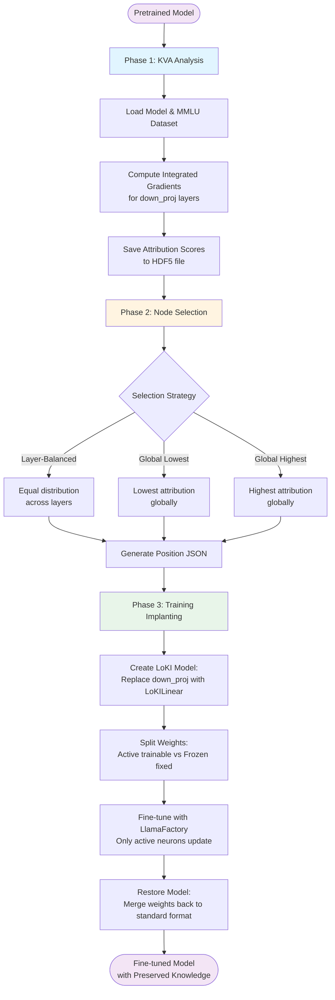

# LoKI: Low-damage Knowledge Implanting of Large Language Models

> **Accepted as AAAI-26 Oral**  

> **🌐 Project Page**: [https://nexround.github.io/LoKI-Page/](https://nexround.github.io/LoKI-Page/)



## Abstract

Fine-tuning adapts pretrained models for specific tasks but poses the risk of catastrophic forgetting (CF), where critical knowledge from pretraining is overwritten. To address the issue of CF in a general-purpose framework, we propose **Lo**w-damage **K**nowledge **I**mplanting (**LoKI**), a parameter-efficient fine-tuning (PEFT) technique that utilizes recent mechanistic understanding of how knowledge is stored in transformer architectures.

We compare LoKI against state-of-the-art PEFT methods in two real-world fine-tuning scenarios. The results show that LoKI demonstrates significantly better preservation of general capabilities. At the same time, its task-specific performance is comparable to or even surpasses that of full parameter fine-tuning and these PEFT methods across various model architectures.

Our work bridges the mechanistic insights of LLMs' knowledge storage with practical fine-tuning objectives, enabling an effective balance between task-specific adaptation and the retention of general-purpose capabilities.


## Usage

### How LoKI Works

This repository provides a complete pipeline for implementing LoKI, but **does not directly provide training tools**. Instead, we delegate training to existing mature frameworks. The core functionality is **model conversion**: you can transform a standard Hugging Face model into a LoKI-modified model using `LoKILinear`, which can then be fine-tuned using **any training pipeline that supports Hugging Face models** (e.g., LlamaFactory).

LoKI replaces the standard FFN (Feed-Forward Network) down-projection layers in transformer models with a custom `LoKILinear` module. The modified model is packaged in Hugging Face's standard format, ensuring full compatibility with the Hugging Face ecosystem for both inference and training operations.

The `LoKILinear` layer splits each down-projection weight matrix into two parts:
- **Active weights**: Trainable parameters at selected neuron positions (determined by KVA analysis)
- **Frozen weights**: Fixed parameters at all other positions

---

This project uses **uv** for dependency management. The training workflow is based on **Llama-Factory**.

### Setup

```bash
# Install uv if not already installed
curl -LsSf https://astral.sh/uv/install.sh | sh

# Install dependencies
cd LoKI
uv sync

# Install Llama-Factory in the UV environment (for training)
uv pip install llama-factory
```


### CLI

After `uv sync`, the `loki` console script is available. Use `uv run loki --help` for full options.

- **Generate trainable node positions from KVA output**:
  ```bash
  uv run loki select-nodes
    --hdf5-path kva_result/hdf5/Llama-3.1-8B-Instruct/kva_mmlu.h5
    --quota 10
    --strategy layer_balanced
  ```

- **Create a LoKI model from pretrained weights**:
  ```bash
  uv run loki create-model
    --model-name meta-llama/Llama-3.1-8B-Instruct
    --target-pos-path kva_result/pos_json/Llama-3.1-8B-Instruct/10.json
    --save-dir models/loki_llama_10
    --torch-dtype bfloat16
  ```

- **Restore a LoKI model back to standard format**:
  ```bash
  uv run loki restore-model
    --model-path models/loki_llama_10
    --target-pos-path kva_result/pos_json/Llama-3.1-8B-Instruct/10.json
    --output-path models/restored_llama
    --model-name meta-llama/Llama-3.1-8B-Instruct
  ```

### Workflow Overview

The LoKI workflow consists of three phases:

1. **Analysing**: Evaluate the contribution of each knowledge vector to general tasks..
2. **Selecting**: Choose trainable knowledge vectors within each FFN based on the analysis results.
3. **Implanting**: Train the chosen vectors to incorporate task-specific knowledge.



---

## Phase 1: KVA Analysis

The current code uses **Captum's LayerIntegratedGradients** for the KVA process and supports Qwen2.5 and Llama series models.


### Quick Start

```bash
# Original (single sample, single GPU)
make analysing_mmlu_qwen
make analysing_mmlu_llama

# Batch processing (2-4x faster, single GPU)
make analysing_mmlu_qwen_batch
make analysing_mmlu_llama_batch

# Multi-GPU data parallelism (linear scaling)
make analysing_mmlu_qwen_data_parallel
make analysing_mmlu_llama_data_parallel

# Model parallelism (for large models)
make analysing_mmlu_llama_model_parallel

# Quick test (10 samples per subset)
make test_analyse_qwen
make test_analyse_llama
```

### Manual Execution

**Original script** (single sample processing):
```bash
uv run accelerate launch --mixed_precision bf16 scripts/analyse_mmlu.py
    --model_path meta-llama/Llama-3.1-8B-Instruct
    --output_dir kva_result/hdf5/Llama-3.1-8B-Instruct
    --result_file kva_mmlu.h5
    --write_mode w
    --max_samples_per_subset 50  # limit samples per subset
```

**Parallel script** (batch + multi-GPU support):
```bash
# Single GPU with batch processing (4x faster)
uv run python scripts/analyse_mmlu.py
    --model_path meta-llama/Llama-3.1-8B-Instruct
    --output_dir kva_result/hdf5/Llama-3.1-8B-Instruct
    --batch_size 4
    --result_file kva_mmlu_batch.h5
    --use_flash_attention

# Multi-GPU data parallelism (samples across GPUs)
uv run accelerate launch --num_processes 4 --mixed_precision bf16
    scripts/analyse_mmlu.py
    --model_path meta-llama/Llama-3.1-8B-Instruct
    --output_dir kva_result/hdf5/Llama-3.1-8B-Instruct
    --batch_size 2
    --parallel_mode data
    --result_file kva_mmlu_data_parallel.h5

# Multi-GPU model parallelism (model layers across GPUs)
uv run python scripts/analyse_mmlu.py
    --model_path meta-llama/Llama-3.1-8B-Instruct
    --output_dir kva_result/hdf5/Llama-3.1-8B-Instruct
    --batch_size 4
    --parallel_mode model
    --result_file kva_mmlu_model_parallel.h5
```

**Integration settings**: Controlled in `src/loki/constants.py` (`DEFAULT_IG_METHOD`, `DEFAULT_IG_STEPS`).

**Output**: HDF5 file containing attribution scores in `kva_result/hdf5/<model_name>/kva_mmlu.h5`


---

## Phase 2: Node Selection

Use attribution scores from KVA to select trainable neurons. We provide pre-computed position JSONs in `kva_result/pos_json/`.

### Selection Strategies

**Layer-Balanced** (default - equal distribution across layers):
```bash
uv run loki select-nodes
    --hdf5-path kva_result/hdf5/Llama-3.1-8B-Instruct/kva_mmlu.h5
    --quota 10
    --strategy layer_balanced
```

**Global Lowest** (select globally lowest attribution):
```bash
uv run loki select-nodes
    --hdf5-path kva_result/hdf5/model/kva_mmlu.h5
    --quota 30
    --strategy global_lowest
    --output-name global_30_L.json
```

**Global Highest** (select globally highest attribution):
```bash
uv run loki select-nodes
    --hdf5-path kva_result/hdf5/model/kva_mmlu.h5
    --quota 30
    --strategy global_highest
    --output-name global_30_H.json
```

**Output**: JSON file with trainable node positions per layer

---

## Phase 3: Training (Implanting)

### Step 1: Create LoKI Model

Convert standard model to LoKI model (replaces down_proj with LoKILinear):

```bash
# Llama
uv run loki create-model
    --model-name meta-llama/Llama-3.1-8B-Instruct
    --target-pos-path kva_result/pos_json/Llama-3.1-8B-Instruct/10.json
    --save-dir models/loki_llama_10

# Qwen (model-type auto-inferred)
uv run loki create-model
    --model-name Qwen/Qwen2.5-0.5B-Instruct
    --target-pos-path kva_result/pos_json/Qwen2.5-0.5B-Instruct/10.json
    --save_dir models/loki_qwen_10
```

### Step 2: Configure Training

Modify training configuration in `lf_config/<dataset>/`:

1. Edit `<dataset>.yaml`:
   - Set `model_name_or_path` to your LoKI model directory
   - Set `output_dir` for checkpoints
   - Configure `deepspeed` path
   - Fields marked with `()` require manual configuration

2. Edit `train.sh`:
   - Update `LLAMA_FACTORY_PATH` variable

### Step 3: Train

```bash
cd lf_config/<dataset>
bash train.sh
```

### Step 4: Restore Model (After Training)

Convert LoKI model back to standard format:

```bash
uv run loki restore-model
    --model-path models/loki_llama_10
    --target-pos-path kva_result/pos_json/Llama-3.1-8B-Instruct/10.json
    --output-path models/restored_llama
    --model-name meta-llama/Llama-3.1-8B-Instruct
```

If using LoRA, merge adapter first:
```python
from transformers import AutoModel
from peft import PeftModel

base_model = AutoModel.from_pretrained("models/loki_model")
lora_model = PeftModel.from_pretrained(base_model, "models/lora_adapter")
merged_model = lora_model.merge_and_unload()
merged_model.save_pretrained("models/merged")

# Then restore using loki restore-model
```

---

## Python API

All functionality is also available as Python API:

```python
# Selection
from loki.selection import (
    select_trainable_nodes_layer_balanced,
    load_attributions_from_hdf5,
    save_positions_to_json,
)

scores = load_attributions_from_hdf5("kva_result/hdf5/model/kva_mmlu.h5")
positions = select_trainable_nodes_layer_balanced(scores, quota=10.0)
save_positions_to_json(positions, "kva_result/pos_json/model/10.json")

# Model creation
from loki import create_loki_model, restore_loki_model

create_loki_model(
    model_name="meta-llama/Llama-3.1-8B-Instruct",
    target_pos_path="kva_result/pos_json/model/10.json",
    save_dir="models/loki_model",
)
```

---

## Testing

```bash
# Run unit tests
make test

# With coverage report
make test_cov

# Code quality checks
make format  # Format code with black
make lint    # Lint with ruff
make typecheck  # Type check with mypy
```

---

## Project Structure

```
LoKI/
├── src/loki/
│   ├── core/              # Base classes and LoKILinear
│   ├── models/            # Architecture registry
│   │   ├── __init__.py    # Registry exports
│   │   └── registry.py    # Dynamic model class generation
│   ├── selection/         # Node selection strategies
│   ├── utils/             # Utilities (logging, HDF5, etc.)
│   └── cli.py             # CLI entry point
├── scripts/               # Analysis scripts
│   └── analyse_mmlu.py    # Unified KVA analysis
├── lf_config/             # LlamaFactory training configs
├── kva_result/            # KVA results and position JSONs
├── models/                # Saved LoKI models
└── tests/                 # Test suite
```

## Citation

```bibtex
@inproceedings{wang2026loki,
  title={LoKI: Low-damage Knowledge Implanting of Large Language Models},
  author={Runyu Wang and Peng Ping and Zhengyu Guo and Xiaoye Zhang and Quan Shi and Liting Zhou and Tianbo Ji},
  booktitle={Proceedings of the AAAI Conference on Artificial Intelligence},
  year={2026}
}
```
